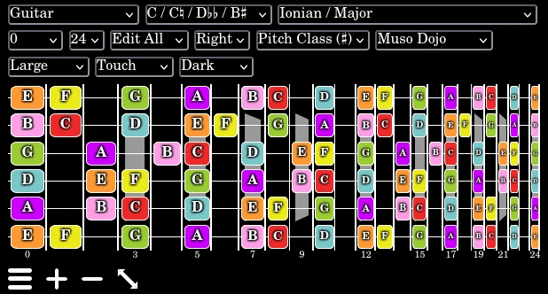
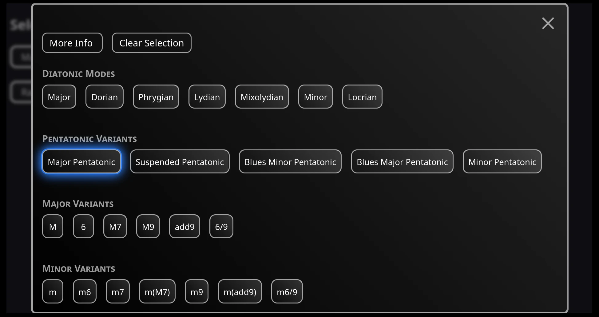

# Conor Dowdall

Software Developer, Mentor, and Technical Writer with a passion for

- music
- education
- open source
- building useful tools

I enjoy working in Linux environments and turning creative ideas into reality.

I'm currently focused on **TypeScript** and **JavaScript**, but I have a diverse
background in other languages and environments:

- C / C++ / Qt
- Python
- Java
- Scripting & Science (Bash, Matlab, LaTeX, Perl)

---

### Web Component Specialist

I specialize in developing custom Web Components to build tools that are
**immune from framework drift**. By leveraging browser standards, I create UI
elements that are:

- **Future-proof:** Sustainable codebases that outlive specific framework
  versions.
- **Interoperable:** Compatible with React, Angular, Svelte, Vue, and vanilla
  JS.
- **Production Ready:** Developed with robust TypeScript, fully tested, and ARIA
  accessible.

#### Component Showcase

Here are examples of complex, framework-agnostic components I've built:

For an example of my technical writing and documentation standards, please see
the
[Enharmonic Note Selector](https://github.com/conor-dowdall/enharmonic-note-selector)
repository.

#### Solid Fundamentals

- deep understanding of JavaScript / ECMAScript
- up to date with modern standards
- latest CSS & HTML
- familiar with all modern tech stacks like React, Next, Angular, Svelte, etc.

---

### Muso Dojo

My main passion project is Muso Dojo.

- suite of tools for teachers and learners of music and music theory
- fully open source (CC0 licensed)

#### @musodojo/music-theory-data

A lightweight, zero-dependency library for music theory data. Simply import the
module and all the music theory stuff is taken care of including a comprehensive
set of utility functions and data about what I've called "note collections",
e.g. "Ionian", "Dominant 7", etc.

**Available on:**

- 📦 **npm:**
  [@musodojo/music-theory-data](https://www.npmjs.com/package/@musodojo/music-theory-data)
- 🦕 **JSR:**
  [@musodojo/music-theory-data](https://jsr.io/@musodojo/music-theory-data)

---

### 🛠️ Tech Stack & Skills

- **Languages:** JavaScript, TypeScript, Java, C++, C, SQL, HTML, CSS
- **Frameworks & Runtimes:** Node.js, Deno, Angular, React, Svelte, Qt
- **Tools & Platforms:** Git, GitHub, Vite, npm, JSR, Docker, Azure, AWS
- **Other:** Agile Methodologies, Database Design, Bash Scripting, LaTeX

---

### 🎓 Qualifications

- **HDip in Science in Software Development** - _First Class Honours_
- **NFQ Level 9 Certificate in Innovation, Entrepreneurship and Enterprise** -
  _Master's Level equivalent_
- **MSc Science - Physics and Instrumentation** - _Researched gamma-rays with
  the [VERITAS](https://veritas.sao.arizona.edu/) collaboration_
- **BAI Electronic Engineering**
- **BA Engineering Mathematics**

---

> "I am attempting to fill a silent moment with non-relevant conversation."
>
> — Lt. Cmdr. Data, _Star Trek: The Next Generation_
