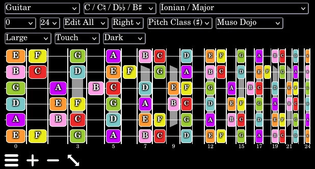
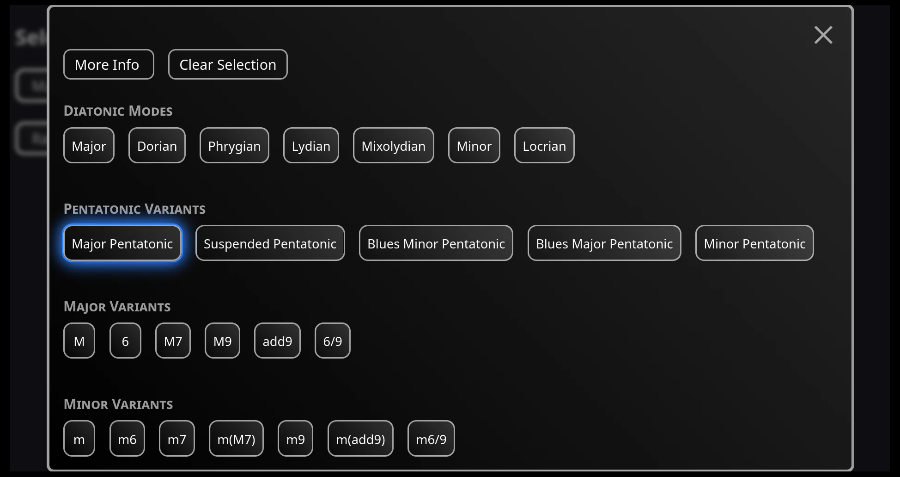

# Conor Dowdall

**Audio Software Engineer & Open-Source Maintainer**  
_Fusing engineering, physics, and music to build creative tools._

---

### 🎨 Component Showcase

Here are some examples of complex UI components I've built:

### 🎸 Muso Dojo

My main passion project: a suite of open-source tools for music theory education.

- **Core Library:** [@musodojo/music-theory-data](https://jsr.io/@musodojo/music-theory-data)
- **Available on:** [npm](https://www.npmjs.com/package/@musodojo/music-theory-data) & [JSR](https://jsr.io/@musodojo/music-theory-data)

---

### 🛠️ Tech Stack

- **Interests:** Music, Education, Open Source, Linux
- **Main Languages:** TypeScript, JavaScript, Java, C++, Python, SQL
- **Runtimes & Frameworks:** Node.js, Deno, React, Angular, Qt
- **Tools:** Git, GitHub, Docker, Vite, JSR, Azure, AWS, Bash, LaTeX

---

### 🎓 Qualifications

- **HDip Software Development** (First Class Honours)
- **MSc Science (Physics)** - Gamma-ray research with [VERITAS](https://veritas.sao.arizona.edu/)
- **BAI Electronic Engineering** | **BA Engineering Mathematics**
- **NFQ Level 9 Certificate** in Innovation, Entrepreneurship and Enterprise
